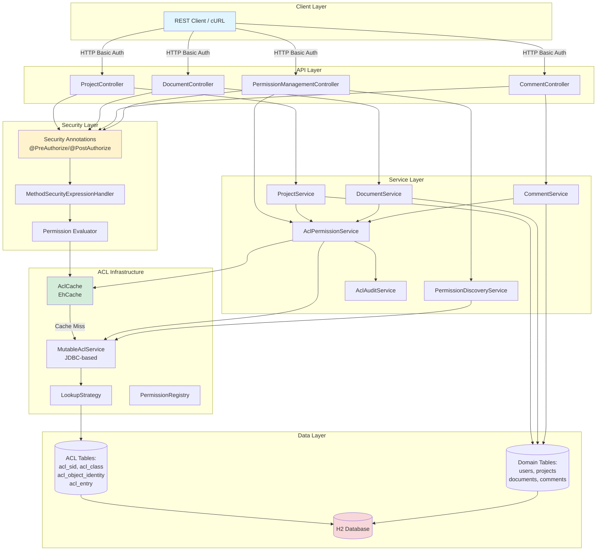
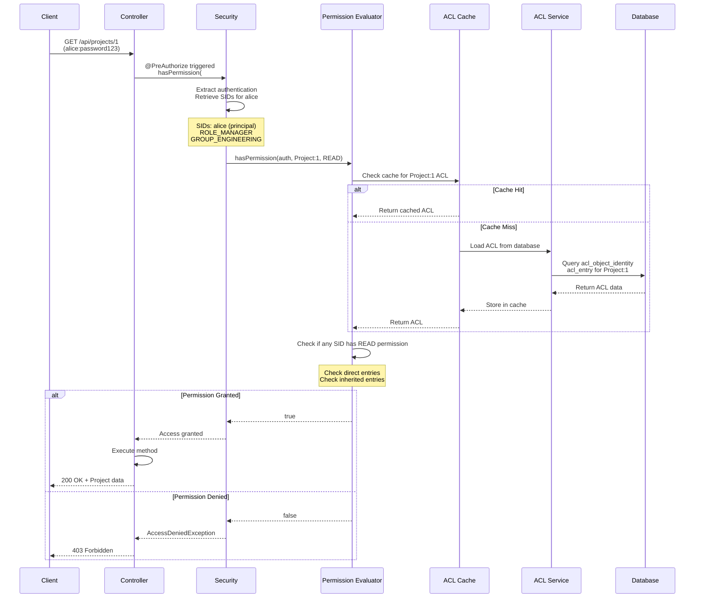
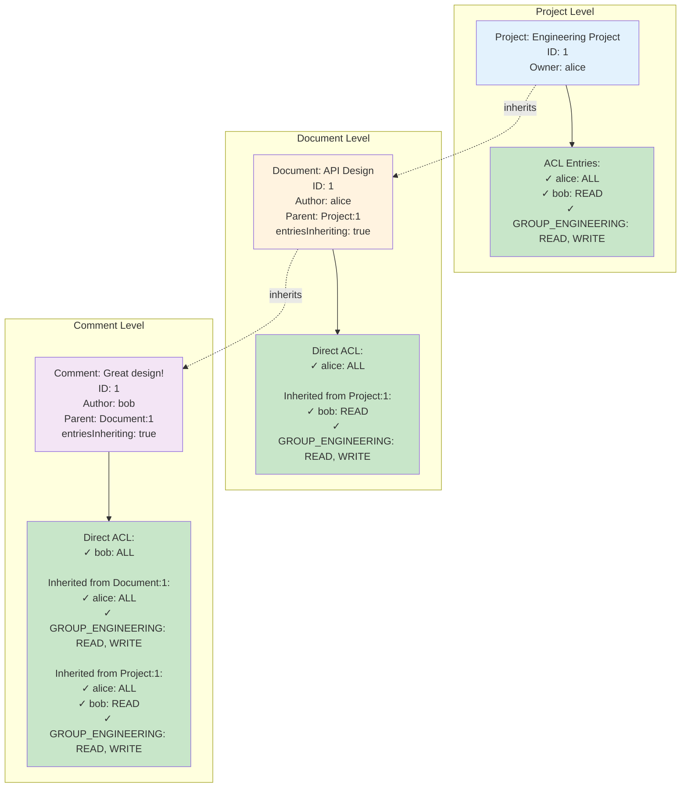
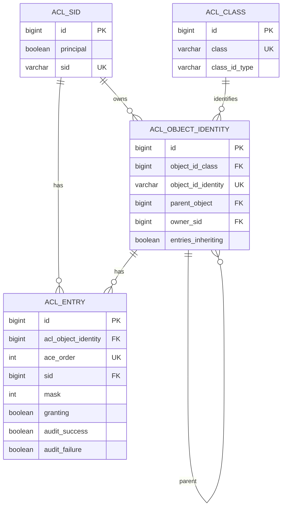
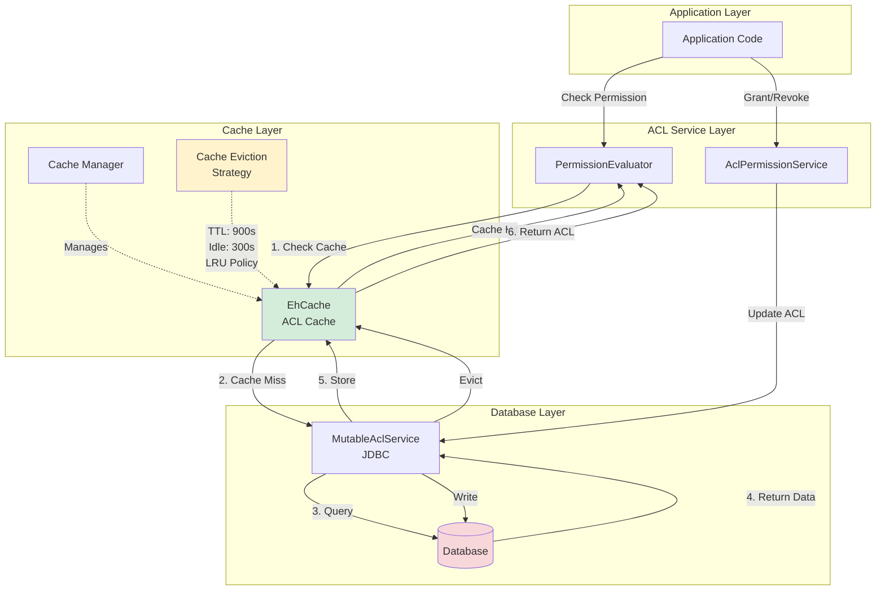
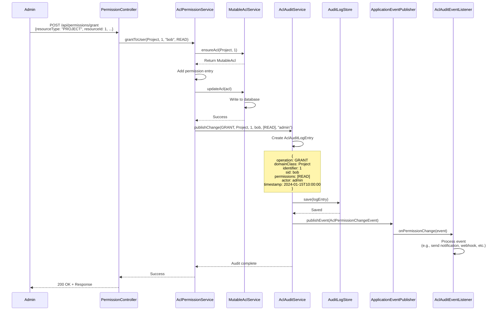
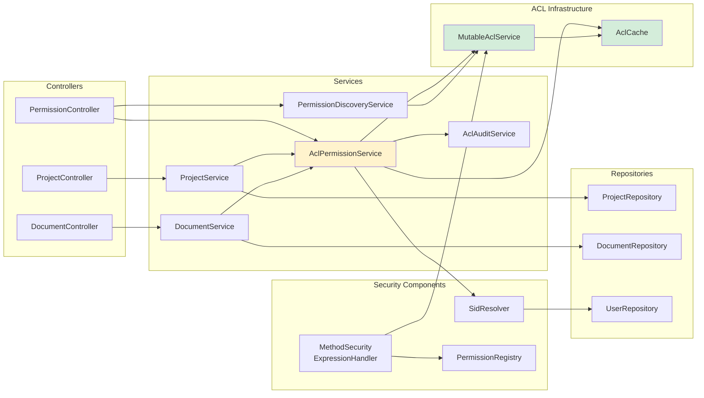
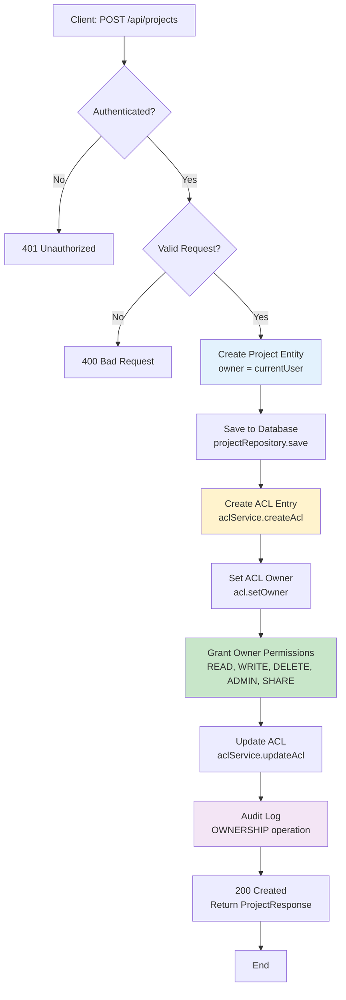
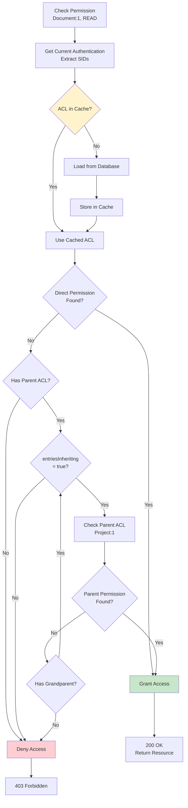
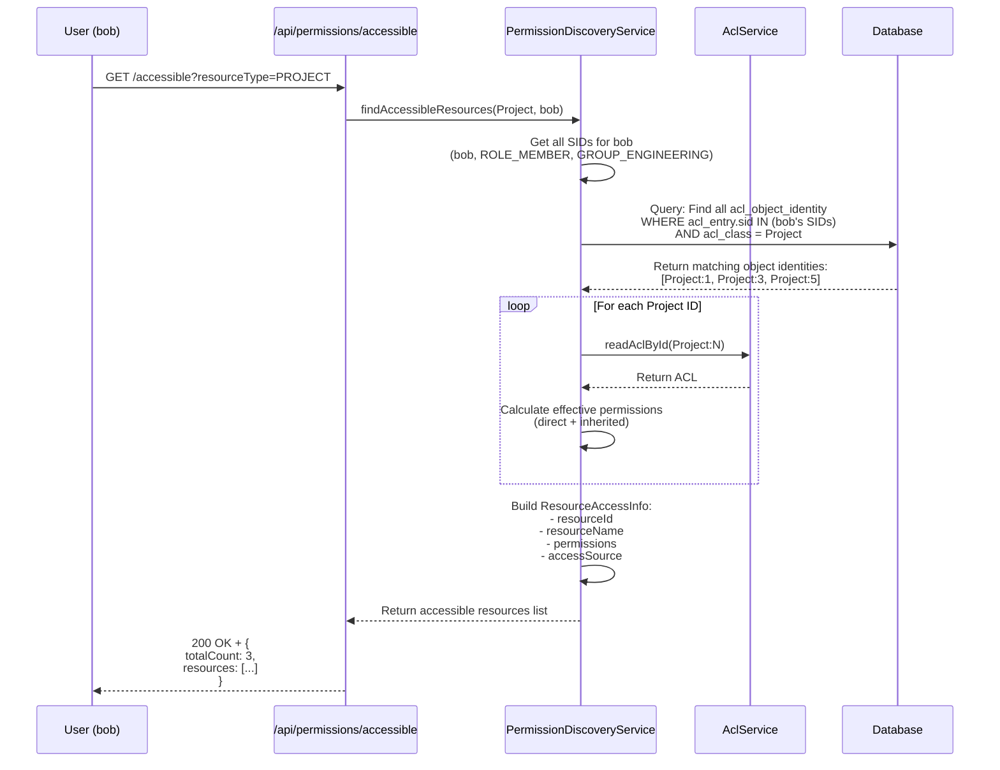

# ACL Demo - Architecture Diagrams

This document contains visual diagrams explaining the ACL system architecture, flows, and component interactions.

## Table of Contents

1. [System Architecture Overview](#system-architecture-overview)
2. [ACL Permission Check Flow](#acl-permission-check-flow)
3. [Permission Inheritance Hierarchy](#permission-inheritance-hierarchy)
4. [ACL Database Schema](#acl-database-schema)
5. [Caching Architecture](#caching-architecture)
6. [Audit Trail Flow](#audit-trail-flow)
7. [Component Interaction](#component-interaction)
8. [Request Processing Flow](#request-processing-flow)

---

## System Architecture Overview



---

## ACL Permission Check Flow



---

## Permission Inheritance Hierarchy



### Inheritance Rules

1. **entriesInheriting = true**: Child inherits parent's ACL entries
2. **Multiple Levels**: Inheritance cascades through multiple levels
3. **Permission Union**: Effective permissions = Direct + Inherited
4. **Parent Must Exist**: Parent ACL must be created before setting inheritance
5. **Order of Checking**: Direct entries checked first, then inherited entries

---

## ACL Database Schema



### Table Descriptions

#### acl_sid (Security Identity)
Stores subjects (users, roles, groups):
```
| id | principal | sid                 |
|----|-----------|---------------------|
| 1  | true      | alice               |
| 2  | false     | ROLE_ADMIN          |
| 3  | false     | GROUP_ENGINEERING   |
```

#### acl_class (Domain Class)
Stores domain object types:
```
| id | class                           |
|----|---------------------------------|
| 1  | com.example.acl.domain.Project  |
| 2  | com.example.acl.domain.Document |
| 3  | com.example.acl.domain.Comment  |
```

#### acl_object_identity (Object Instance)
Stores individual resource instances:
```
| id | object_id_class | object_id_identity | parent | owner_sid | entries_inheriting |
|----|-----------------|--------------------| -------|-----------|-------------------|
| 1  | 1               | 1                  | NULL   | 1         | true              |
| 2  | 2               | 1                  | 1      | 1         | true              |
| 3  | 3               | 1                  | 2      | 2         | true              |
```

#### acl_entry (Permission Grant)
Stores permission entries:
```
| id | acl_object_identity | ace_order | sid | mask | granting |
|----|---------------------|-----------|-----|------|----------|
| 1  | 1                   | 0         | 1   | 31   | true     |
| 2  | 1                   | 1         | 2   | 1    | true     |
| 3  | 2                   | 0         | 1   | 31   | true     |
```

**Permission Masks:**
- READ = 1
- WRITE = 2
- CREATE = 4
- DELETE = 8
- ADMINISTRATION = 16
- SHARE = 32
- APPROVE = 64
- ALL (R+W+C+D+A) = 31

---

## Caching Architecture



### Cache Configuration

```java
CacheConfiguration:
  - Name: aclCache
  - Eviction Policy: LRU (Least Recently Used)
  - Time to Live: 900 seconds (15 minutes)
  - Time to Idle: 300 seconds (5 minutes)
  - Max Entries: 2048
  - Eternal: false
```

### Cache Behavior

1. **Read Path**:
   - Check cache first
   - On miss, load from database and cache
   - Return ACL to caller

2. **Write Path**:
   - Update database
   - Evict affected cache entries
   - Next read will reload from database

3. **Automatic Eviction**:
   - TTL expired
   - Idle time exceeded
   - LRU when capacity reached

4. **Manual Eviction**:
   - On ACL updates via `aclService.updateAcl()`
   - Via `AclPermissionService.evictCache()`

---

## Audit Trail Flow



### Audit Log Entry Structure

```json
{
  "id": "uuid",
  "timestamp": "2024-01-15T10:00:00",
  "operation": "GRANT",
  "domainClass": "com.example.acl.domain.Project",
  "identifier": "1",
  "sid": "bob",
  "permissions": ["READ", "WRITE"],
  "actor": "admin",
  "metadata": {
    "ipAddress": "192.168.1.100",
    "userAgent": "curl/7.68.0"
  }
}
```

### Audit Operations

- **GRANT**: Permission granted to a subject
- **REVOKE**: Permission revoked from a subject
- **OWNERSHIP**: Ownership assigned or changed
- **INHERITANCE**: Parent-child relationship established
- **CREATE**: New ACL created

---

## Component Interaction



---

## Request Processing Flow

### Create Project with ACL



### Check Permission with Inheritance



### Bulk Permission Grant

```mermaid
graph TD
    Start[POST /api/permissions/bulk-update] --> AuthCheck{Has ADMIN/MANAGER<br/>Role?}
    
    AuthCheck -->|No| Forbidden[403 Forbidden]
    AuthCheck -->|Yes| Parse[Parse Request<br/>resourceIds: [1,2,3]<br/>subject: bob<br/>permissions: [READ,WRITE]]
    
    Parse --> ResolveSID[Resolve SID<br/>for subject 'bob']
    ResolveSID --> ResolvePerms[Resolve Permissions<br/>READ, WRITE]
    
    ResolvePerms --> Loop{For Each<br/>Resource ID}
    
    Loop --> EnsureACL[Ensure ACL Exists<br/>for Resource]
    EnsureACL --> AddPerms[Add Permissions<br/>if Missing]
    AddPerms --> UpdateACL[Update ACL]
    UpdateACL --> Audit[Audit Log Entry]
    
    Audit --> Loop
    Loop -->|All Done| Response[200 OK<br/>resourcesAffected: 3]
    
    style AuthCheck fill:#fff3cd
    style Loop fill:#e3f2fd
    style Audit fill:#f3e5f5
```

---

## Permission Discovery Flow



---

## Summary

These diagrams illustrate:

1. **System Architecture**: Overall component layout and dependencies
2. **Permission Check Flow**: How ACL permissions are evaluated at runtime
3. **Inheritance Hierarchy**: How permissions cascade through parent-child relationships
4. **Database Schema**: ACL table structure and relationships
5. **Caching Architecture**: How EhCache optimizes ACL lookups
6. **Audit Trail Flow**: How permission changes are logged and tracked
7. **Component Interaction**: How services, repositories, and ACL infrastructure interact
8. **Request Processing**: End-to-end flows for common operations

For implementation details, see the [Developer Guide](../DEVELOPER_GUIDE.md).
